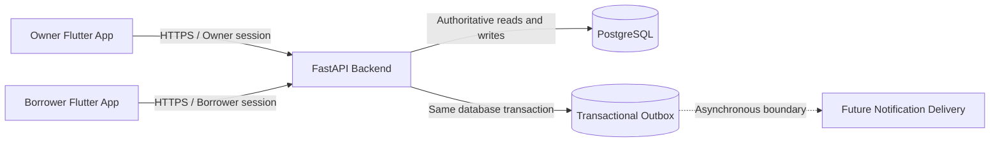
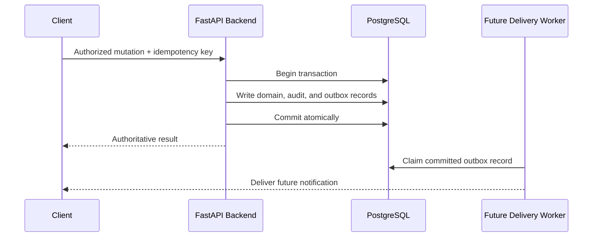

# Lending Nelson V2 — Architecture Specification

## 1. Purpose and Current State

Lending Nelson V2 is a clean-slate, single-business lending platform with separate mobile
experiences for the Owner and Borrowers. This document defines the target architecture and its
boundaries. M01 contains documentation only; none of the applications or services shown below
are implemented yet.

## 2. System Context



- **Owner Flutter App:** The single Owner's operational client for borrowers, loans, payments,
  settings, accounting, and reports.
- **Borrower Flutter App:** A separate borrower-facing client for registration, activation,
  account access, requests, balances, receipts, and notifications.
- **FastAPI Backend:** The only API and authoritative domain boundary. It authenticates callers,
  authorizes actions, calculates financial results, and owns transactions.
- **PostgreSQL:** The authoritative persistent store for identities, lending records, financial
  state, audit records, idempotency records, and transactional outbox entries.
- **Notification/outbox boundary:** Domain transactions persist notification intent to an outbox.
  External delivery occurs asynchronously and never becomes an untracked side effect inside a
  financial transaction.

## 3. Identity and Authentication Boundaries

The application serves exactly one business Owner. It does not contain business-side roles named
`admin`, `administrator`, `officer`, `manager`, `staff`, `collector`, `cashier`, or `supervisor`,
and it does not need a staff permission matrix.

Owner and Borrower authentication are separate security domains:

```mermaid
flowchart TB
    OC[Owner Credentials] --> OA[Owner Authentication]
    OA --> OS[Owner Session and Claims]
    OS --> OE[Owner-only Endpoints]

    BC[Borrower Credentials] --> BA[Borrower Authentication]
    BA --> BS[Borrower Session and Claims]
    BS --> BE[Borrower-scoped Endpoints]

    BS -. no privilege path .->|prohibited| OE
```

- Owner and Borrower identities do not share a generic user or session abstraction that could
  blur privileges.
- A Borrower session never grants Owner authority.
- Borrower-scoped operations resolve borrower identity from verified session claims, not from an
  untrusted request body identifier.
- Cross-borrower access is denied even when a caller knows another record's identifier.
- Authentication details are introduced in later milestones and are not implemented in M01.

## 4. Target Monorepo Structure

The intended structure is documented now and created only when its milestone begins:

```text
lending_nelson_v2/
├── apps/
│   ├── owner_mobile/       # Future Owner Flutter application
│   └── borrower_mobile/    # Future Borrower Flutter application
├── backend/                # Future FastAPI application
├── docs/
│   ├── architecture/
│   ├── domain/
│   └── development/
├── scripts/                # Future operational/development scripts
├── AGENTS.md
├── README.md
└── ROADMAP.md
```

Applications are separate deployable/buildable units but share documented API contracts and
canonical domain terminology.

## 5. Feature-Oriented Backend Architecture

When introduced, backend code is organized by cohesive domain feature rather than global dump
files:

```text
backend/app/
├── main.py
├── api/                    # API composition and versioning
├── core/                   # Configuration and security primitives
├── db/                     # SQLAlchemy/Alembic infrastructure and model registry
├── features/
│   └── <feature>/
│       ├── models.py       # Split further when the feature grows
│       ├── schemas.py
│       ├── service.py
│       ├── router.py
│       └── exceptions.py
└── shared/                 # Narrow, genuinely cross-feature primitives
```

Features own their domain models, schemas, routes, services, and tests. Canonical services own
calculations and state transitions; route handlers coordinate them rather than reimplementing
business rules. Large files are split by responsibility without creating unnecessary layers.

## 6. API Boundary

- Clients communicate with the backend through explicit, versioned HTTPS APIs.
- Request schemas validate shape, but authenticated context determines identity and authority.
- Responses return backend-calculated quotes, schedules, balances, allocations, and totals.
- Errors use stable domain meanings without exposing stack traces, database details, secrets, or
  the existence of another Borrower's private records.
- Duplicate-sensitive mutation APIs use idempotency keys or an equivalent durable mechanism.
- Mobile clients may calculate presentation-only values but never authoritative financial state.

## 7. Financial Authority

The backend owns all authoritative financial rules:

- New loans use only Flexible Reducing-Balance repayment.
- Only Monthly and Twice-a-Month frequencies are accepted. Weekly schedules are not supported.
- Interest-Only and other alternate repayment modes are not supported.
- Money and rates use Python `Decimal`; PostgreSQL stores them in explicitly sized `NUMERIC`
  columns. Binary floating-point is prohibited for authoritative calculations.
- Rounding happens only under a documented domain policy at explicit calculation boundaries.
- Clients submit facts and intent; the backend returns the authoritative result.

The canonical formulas and examples live in `docs/domain/LOAN_RULES.md` and must be implemented
once, behind tested domain services.

## 8. Database and Transaction Authority

PostgreSQL is the durable source of truth. Database constraints protect identifiers, uniqueness,
relationships, statuses, nonnegative financial values, and singleton invariants where
appropriate.

- All schema evolution uses reviewed Alembic migrations; no persistent schema is changed ad hoc.
- Financial mutations execute atomically. Payment recording, disbursement, reversal, accounting,
  receipt creation, audit events, and required outbox writes succeed or roll back together when
  they belong to the same operation.
- Payment, disbursement, activation-style, reversal, and similar mutations receive durable
  idempotency protection against retries and concurrent duplicates.
- Production and development data are never used as destructive test targets. Integration tests
  use an explicitly separate local test database.
- UTC instants are stored using timezone-aware database types; user-facing timezone conversion is
  a presentation concern.

## 9. Notification and Outbox Boundary



The outbox prevents an external notification outage from partially applying or losing the intent
of a successful domain operation. Delivery, retry, and deduplication are later milestones.

## 10. Audit and Security Principles

- Apply least privilege at the API, service, and database connection boundaries.
- Store credentials and sensitive tokens only as strong hashes when verification does not require
  plaintext; never log secrets.
- Record immutable audit events for sensitive identity, loan, payment, reversal, settings, and
  accounting actions when those domains are introduced.
- Include actor domain, actor identifier, action, target, timestamp, and safe request context in
  audit records without storing credentials or excessive personal data.
- Validate state transitions server-side and protect them with database transactions and
  constraints.
- Return non-enumerating responses where identity or cross-borrower information could leak.
- Keep configuration in environment variables and ignored local files; commit only safe examples.

## 11. Testing Strategy

Testing grows with each milestone:

- **Unit tests:** Exact calculations, rounding, calendar behavior, validation, and state machines.
- **Service tests:** Canonical business behavior, transaction boundaries, idempotency, and rollback.
- **Database integration tests:** Real local PostgreSQL constraints, relationships, indexes, and
  migration upgrade/downgrade behavior using a protected test database.
- **API tests:** Authentication separation, authorization, error contracts, retries, and
  cross-borrower isolation.
- **Flutter tests:** State, navigation, widgets, API integration boundaries, and secure session
  behavior without duplicating backend financial rules.
- **Regression gates:** Focused tests run first, followed by the relevant complete suite, lint,
  formatting, type checks, migration checks, and builds.

Tests are updated with every behavior change. Authentication or authorization is never bypassed
to make a test pass.

## 12. Deferred Decisions

M01 deliberately does not choose concrete database tables, token formats, endpoint payloads,
deployment providers, or persisted loan-state representation. Each decision belongs to its
roadmap milestone and must remain consistent with the boundaries in this document.
